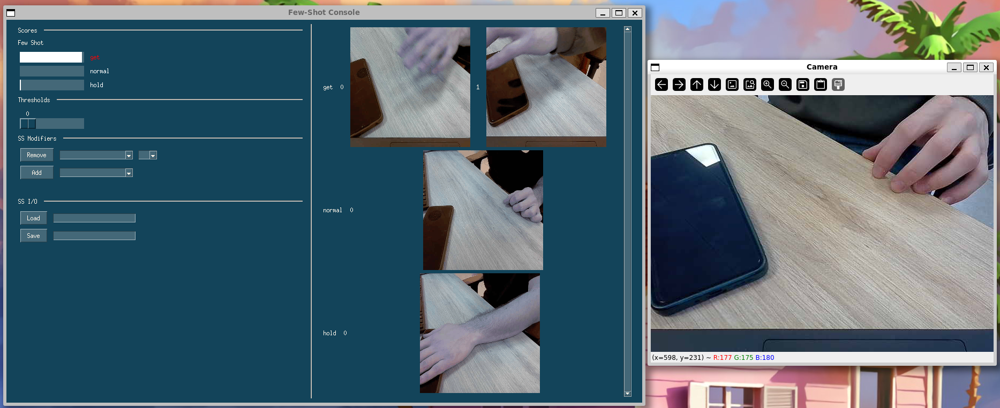

# STRM Demo

This repository contains a simple inference script and a GUI to play with the [STRM](https://github.com/Anirudh257/strm) model (currently SOTA for few-shot action recognition).
The GUI allows to add, visualize and remove actions from the support set.

### Setup
Clone the strm repository
```
https://github.com/Anirudh257/strm.git
```
Download the SSv2 checkpoint `checkpoint75000.pt` from their repository, place it under a `checkpoints` directory in the root.
As environment, use `strm/environment.yaml` + PySimpleGUI + imageio.

### Launch
Lauch inference from the webcam with `python demo/simple_inference.py`
