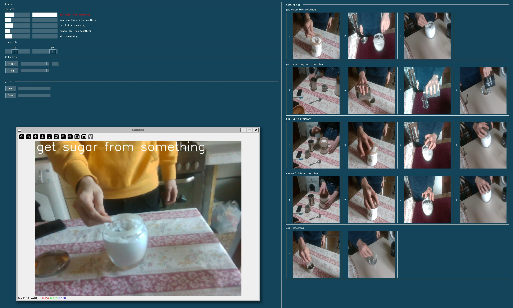

# Few-Shot Console

This repository contains a simple inference script for the models of the paper XXX (currently under blind review, contact @steb6 for a copy) and a GUI that allow to easily collect new demonstrations and to modify known classes.

### Setup
Clone the few-shot-console repository:
```
git clone https://github.com/hsp-iit/few-shot-console.git
```
Install Conda, then create a Conda environment with:
```
conda env create -f environment.yml
```

Download the model checkpoints depending on your target settings:
- Table top:  [download](https://drive.google.com/file/d/13KeWsoa3RGRkX-QaKbQNm6EV8APFYICc/view?usp=sharing) the checkpoint from SSv2
- Human-Robot Interaction: [download](https://drive.google.com/file/d/1D1Jrw1Y47gEICavN0lj8ggQ82uzMTtjq/view?usp=sharing) the checkpoint from NTURGBD120

### Launch
If needed, adjust the setting in config.json.
Within the conda environment activated, launch
```
python demo.py
```
Note that the demo.py script search for available cameras with OpenCV and then select the last one as input source.
Modify this behaviour if needed.

There are two Support Set examples that can be loaded:
- coffee: table-top, use SSv2 checkpoint for this scenario
- hri: human-robot-interaction, use NTURGBD120 for this scenario